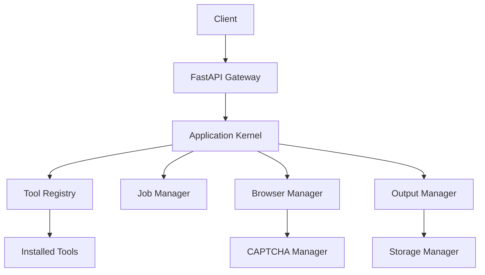

# High Level Architecture

```mermaid
flowchart TD
    Client --> API[FastAPI Gateway]
    API --> Kernel[Application Kernel]
    Kernel --> Registry[Tool Registry]
    Kernel --> Jobs[Job Manager]
    Kernel --> Browser[Browser Manager]
    Kernel --> Output[Output Manager]
    Output --> Storage[Storage Manager]
    Browser --> Captcha[CAPTCHA Manager]
    Registry --> Tools[Installed Tools]
```
