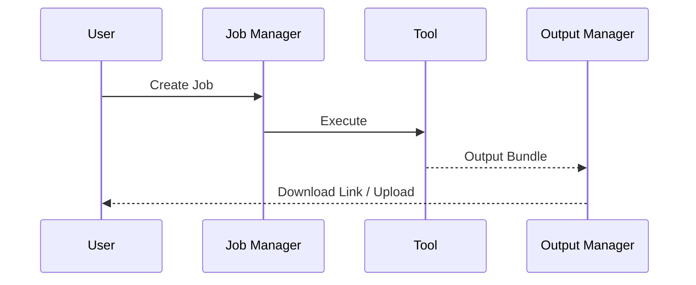

# Job Sequence

```mermaid
sequenceDiagram
    participant U as User
    participant J as Job Manager
    participant T as Tool
    participant O as Output Manager

    U->>J: Create Job
    J->>T: Execute
    T-->>O: Output Bundle
    O-->>U: Download Link / Upload
```
